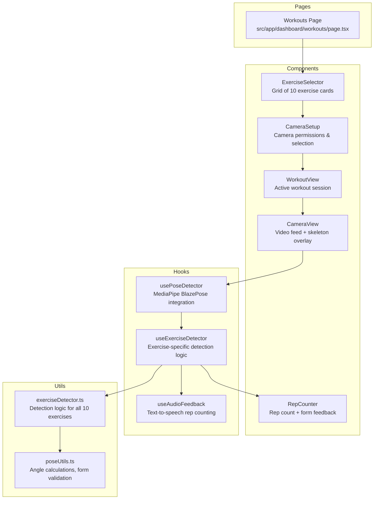

# MediaPipe AI Workout Tracker - Implementation Plan

## Overview
Implement a camera-based workout tracker using MediaPipe BlazePose on the `/dashboard/workouts` page with 10 exercises and full feature set.

## Requirements Summary
- **Exercise Library**: 10 exercises (Squat, Push-up, Jumping Jack, Plank, Lunge, Sit-up, Mountain Climber, High Knees, Glute Bridge, Burpee)
- **Features**: Form correction with skeleton overlay, rep counting, audio cues, front/side camera switch
- **UI Modes**: Grid exercise selection + Sequential workout flow
- **Data**: Save workout sessions to database via existing API

---

## Architecture



---

## Component Structure

```
src/
├── app/dashboard/workouts/
│   └── page.tsx                    # Main page with AI tracker tabs
├── components/
│   └── workout/
│       ├── ExerciseSelector.tsx    # Grid of exercise cards
│       ├── CameraView.tsx           # Video feed with skeleton overlay
│       ├── RepCounter.tsx          # Rep count display + form feedback
│       ├── WorkoutSession.tsx      # Sequential workout flow
│       └── CameraSetup.tsx         # Camera permission + view selection
├── hooks/
│   ├── usePoseDetector.ts          # MediaPipe BlazePose hook
│   ├── useExerciseDetector.ts      # Exercise detection logic
│   └── useAudioFeedback.ts         # Audio feedback hook
└── lib/
    └── workout/
        ├── exerciseDetector.ts      # Detection algorithms
        └── poseUtils.ts             # Angle calculations
```

---

## Exercise Detection Logic

### Key Pose Landmarks (BlazePose 33 points)
- **Head**: nose, left_eye, right_eye, left_ear, right_ear
- **Torso**: left_shoulder, right_shoulder, left_hip, right_hip
- **Arms**: left_elbow, right_elbow, left_wrist, right_wrist
- **Legs**: left_knee, right_knee, left_ankle, right_ankle

### Exercise Detection Rules

| Exercise | Primary Angles | Rep Detection Logic |
|----------|----------------|---------------------|
| Squat | Hip-Knee-Ankle | Track hip lowering (knee angle < 90°), return to standing |
| Push-up | Shoulder-Elbow-Wrist | Track body lowering, elbow angle < 90°, return to start |
| Jumping Jack | Arm angle, Leg spread | Arms: overhead (180°), Legs: wide (lateral spread) |
| Plank | Body alignment | Hold position, straight line shoulder-hip-ankle |
| Lunge | Hip-Knee-Ankle | Track front knee angle, alternate legs |
| Sit-up | Hip angle | Torso rising from floor, hip angle > 150° |
| Mountain Climber | Hip alternating | Alternate leg drives, knee to chest |
| High Knees | Hip-Knee | Alternate knee raise above hip height |
| Glute Bridge | Hip-Knee-Ankle | Hip elevation from floor, back flat |
| Burpee | Combined | Squat → plank → push-up → jump → stand |

---

## Implementation Steps

### Step 1: Add Dependencies
```json
{
  "@mediapipe/pose": "^0.5.1675469404",
  "@mediapipe/camera_utils": "^0.3.1675466862",
  "@mediapipe/drawing_utils": "^0.3.1675466124"
}
```

### Step 2: Create PoseDetector Hook
- Initialize MediaPipe Pose
- Handle camera stream
- Extract landmark coordinates
- Emit pose data at 30fps

### Step 3: Create Exercise Detection Logic
- Implement angle calculation utilities
- Create state machine for each exercise
- Track rep phases (up/down/rep_complete)
- Validate form and provide feedback

### Step 4: Build UI Components
- ExerciseSelector: Card grid with icons and descriptions
- CameraView: Canvas overlay on video feed
- RepCounter: Real-time count with form status
- WorkoutSession: Multi-exercise flow manager

### Step 5: Integrate Audio Feedback
- Web Speech API for rep counting
- Form feedback messages
- Exercise transition cues

### Step 6: Connect to Database
- POST workout sessions to /api/workouts
- Store exercise, reps, duration, timestamp

---

## UI Layout

### Main Page Layout
```
┌─────────────────────────────────────────────────────────┐
│  Workouts                              [AI Tracker] [Log]│
├─────────────────────────────────────────────────────────┤
│                                                         │
│  ┌─ AI Workout Tracker ─────────────────────────────┐  │
│  │                                                     │  │
│  │  [Exercise Grid / Camera View]                    │  │
│  │                                                     │  │
│  │  ┌─────────┐ ┌─────────┐ ┌─────────┐               │  │
│  │  │ Squat   │ │ Push-up │ │ Jumping │               │  │
│  │  │   🏋️   │ │   💪   │ │  Jack   │               │  │
│  │  └─────────┘ └─────────┘ └─────────┘               │  │
│  │                                                     │  │
│  └─────────────────────────────────────────────────────┘  │
│                                                         │
└─────────────────────────────────────────────────────────┘
```

### Active Workout View
```
┌─────────────────────────────────────────────────────────┐
│  ← Back    Squat                          ⏸ Pause     │
├─────────────────────────────────────────────────────────┤
│                                                         │
│  ┌───────────────────────┐  ┌──────────────────────┐  │
│  │                       │  │   REPS: 12            │  │
│  │    [Camera Feed]      │  │   Form: ✓ Good       │  │
│  │    + Skeleton         │  │   Calories: 45        │  │
│  │                       │  │   Time: 1:30          │  │
│  │                       │  │                      │  │
│  │                       │  │   [Start] [Camera]    │  │
│  │                       │  │                      │  │
│  └───────────────────────┘  └──────────────────────┘  │
│                                                         │
└─────────────────────────────────────────────────────────┘
```

---

## Acceptance Criteria

1. ✅ Page loads with exercise grid showing all 10 exercises
2. ✅ Clicking exercise starts camera and begins detection
3. ✅ Skeleton overlay renders correctly on video feed
4. ✅ Reps are counted accurately for each exercise
5. ✅ Form feedback shows (Good/Adjust position)
6. ✅ Audio cues count reps aloud
7. ✅ Can switch between front/side camera view
8. ✅ Sequential workout flow works (multiple exercises)
9. ✅ Workout data saves to database
10. ✅ Works on Chrome desktop with webcam

---

## Risk Mitigation

| Risk | Mitigation |
|------|------------|
| MediaPipe not loading | Add loading states, show setup instructions |
| Camera permission denied | Show clear error message with instructions |
| Poor lighting | Add visibility indicator, suggest better lighting |
| Slow performance | Use requestAnimationFrame, optimize render |
| Browser compatibility | Focus on Chrome, add feature detection |
