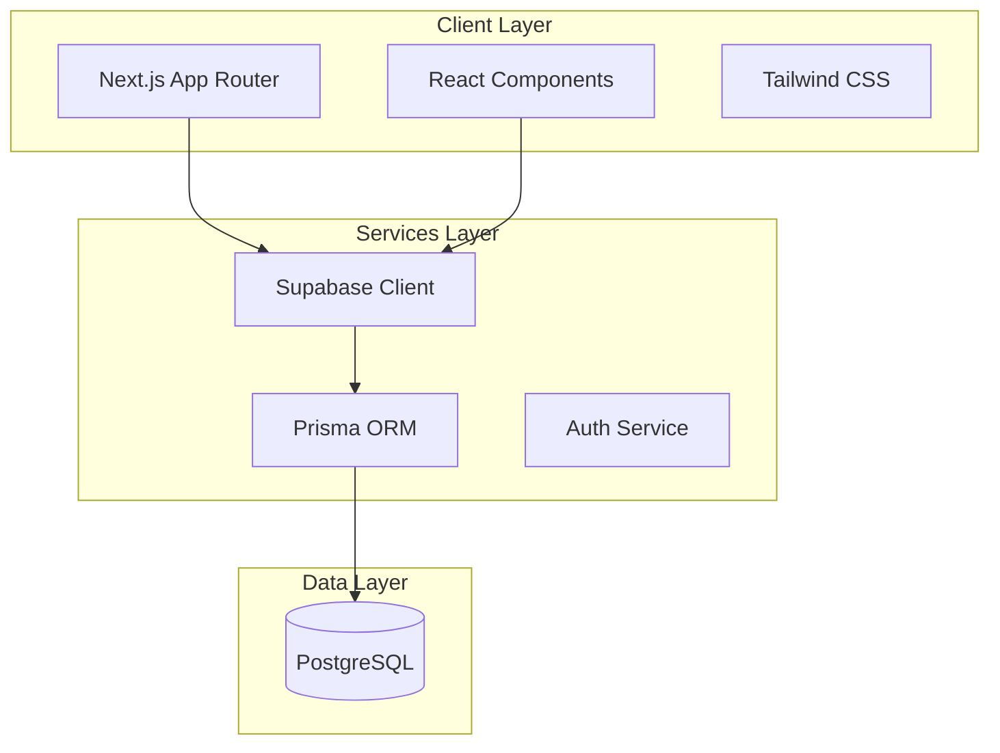

# Nuxwell - Wellness Fitness Platform Conversion Plan

## Project Overview

- **Project Name**: Nuxwell
- **Type**: Full-stack Wellness & Fitness Web Application  
- **Core Functionality**: A comprehensive fitness platform enabling users to track workouts, manage meal plans, monitor progress, and manage their wellness journey with user authentication and personalized dashboards.
- **Target Users**: Fitness enthusiasts, people seeking wellness improvement, personal training clients

---

## Technology Stack

- **Framework**: Next.js 16 (App Router)
- **Language**: TypeScript
- **Styling**: Tailwind CSS v4
- **Backend/Database**: Supabase (PostgreSQL)
- **ORM**: Prisma
- **Icons**: Lucide React
- **Charts**: Recharts
- **Authentication**: Supabase Auth

---

## Architecture Overview



---

## Database Schema

### Tables

1. **profiles** - Extended user profile information
   - id (uuid, FK to auth.users)
   - full_name (text)
   - avatar_url (text)
   - weight (numeric)
   - height (numeric)
   - fitness_goal (text)
   - created_at (timestamp)

2. **workouts** - Workout sessions
   - id (uuid, PK)
   - user_id (uuid, FK)
   - name (text)
   - type (text: cardio, strength, flexibility, hiit)
   - duration_minutes (integer)
   - calories_burned (integer)
   - exercises (jsonb)
   - completed_at (timestamp)
   - created_at (timestamp)

3. **meals** - Meal plans and tracking
   - id (uuid, PK)
   - user_id (uuid, FK)
   - name (text)
   - type (text: breakfast, lunch, dinner, snack)
   - calories (integer)
   - protein (numeric)
   - carbs (numeric)
   - fats (numeric)
   - ingredients (jsonb)
   - logged_at (timestamp)
   - created_at (timestamp)

4. **progress** - Body metrics tracking
   - id (uuid, PK)
   - user_id (uuid, FK)
   - weight (numeric)
   - body_fat_percentage (numeric)
   - measurements (jsonb)
   - notes (text)
   - recorded_at (timestamp)
   - created_at (timestamp)

---

## Page Structure

### Public Pages
1. **Landing Page** (`/`)
   - Hero section with CTA
   - Features overview
   - Testimonials
   - Pricing/Plans
   - Contact/Footer

### Auth Pages
2. **Login** (`/auth/login`)
3. **Register** (`/auth/register`)

### Protected Pages (Dashboard)
4. **Dashboard** (`/dashboard`)
   - Today's summary
   - Quick actions
   - Recent activity
   - Progress overview

5. **Workouts** (`/dashboard/workouts`)
   - Workout history
   - Create new workout
   - Workout types/categories
   - Exercise library

6. **Meals** (`/dashboard/meals`)
   - Meal logging
   - Meal plans
   - Calorie tracking
   - Nutritional info

7. **Progress** (`/dashboard/progress`)
   - Weight tracking chart
   - Body measurements
   - Goals tracking
   - Analytics

8. **Profile** (`/dashboard/profile`)
   - User settings
   - Fitness goals
   - Preferences

---

## UI/UX Design

### Color Palette
- **Primary**: Emerald Green (#10B981) - represents wellness, growth
- **Secondary**: Slate Gray (#64748B) - professional, clean
- **Accent**: Amber (#F59E0B) - energy, motivation
- **Background**: White / Light Gray (#F8FAFC)
- **Dark Mode**: Slate (#1E293B)

### Typography
- **Headings**: Inter (clean, modern)
- **Body**: System fonts via Tailwind

### Components
- Responsive navigation (mobile-first)
- Dashboard sidebar
- Stat cards with icons
- Charts for progress visualization
- Forms with validation
- Modal dialogs
- Toast notifications

---

## Implementation Steps

### Phase 1: Setup & Configuration
1. Install dependencies (Supabase, Lucide, Recharts, Prisma)
2. Initialize Prisma with Supabase
3. Configure Supabase client
4. Set up environment variables (.env.local)
5. Create Prisma schema
6. Run migrations

### Phase 2: Database & Auth
1. Set up Supabase project
2. Configure Prisma schema for all tables
3. Create auth utilities
4. Build auth context/hooks
5. Implement login/register pages

### Phase 3: Core UI Components
1. Layout with navbar/sidebar
2. Reusable components (Card, Button, Input, etc.)
3. Dashboard shell

### Phase 4: Feature Pages
1. Landing page
2. Dashboard home
3. Workouts page
4. Meals page
5. Progress page

### Phase 5: Polish
1. Dark mode support
2. Loading states
3. Error handling
4. Responsive adjustments

---

## File Structure

```
src/
├── app/
│   ├── (auth)/
│   │   ├── login/
│   │   └── register/
│   ├── (dashboard)/
│   │   ├── dashboard/
│   │   │   ├── workouts/
│   │   │   ├── meals/
│   │   │   ├── progress/
│   │   │   └── profile/
│   ├── api/
│   ├── layout.tsx
│   ├── page.tsx
│   └── globals.css
├── components/
│   ├── ui/
│   │   ├── button.tsx
│   │   ├── card.tsx
│   │   ├── input.tsx
│   │   └── ...
│   ├── layout/
│   │   ├── navbar.tsx
│   │   ├── sidebar.tsx
│   │   └── footer.tsx
│   └── features/
│       ├── workout-card.tsx
│       ├── meal-card.tsx
│       ├── progress-chart.tsx
│       └── ...
├── lib/
│   ├── supabase/
│   │   ├── client.ts
│   │   └── server.ts
│   ├── prisma/
│   │   └── client.ts
│   ├── utils.ts
│   └── hooks/
│       ├── use-auth.ts
│       └── use-workouts.ts
├── types/
└── prisma/
    ├── schema.prisma
    └── migrations/
```

---

## Success Criteria

- [ ] Users can register and login
- [ ] Users can log and track workouts
- [ ] Users can log meals and track nutrition
- [ ] Users can view progress charts
- [ ] Dashboard provides actionable insights
- [ ] Responsive design works on all devices
- [ ] Clean, professional wellness-focused UI
